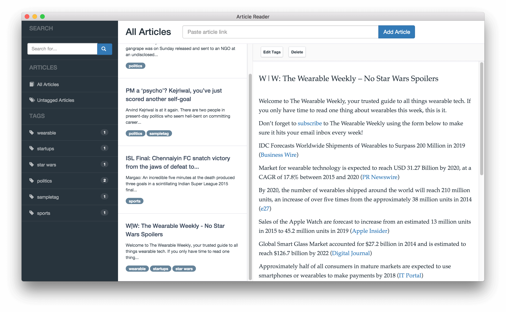

Article Reader
==============

Simple reader where you can add link and read it for later offline.

## Usage

You need to install [Atom/Electron](https://github.com/atom/electron) first, then run it as Electron app.

```
npm install   // install dependencies

gulp build
gulp release   // package app, will create app in release directory.

npm start      // after you build it
```

## ScreenShot


